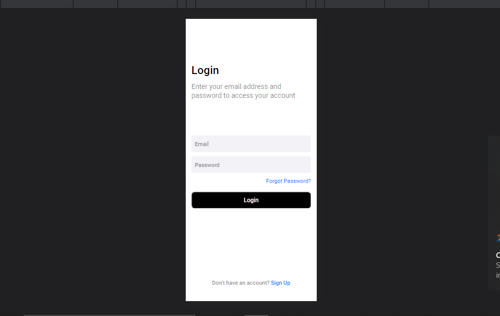

# interface-login

> Uma interface de login usando HTML e CSS

### Ferramentas Usadas

O projeto foi desenvolvido com as seguintes ferramentas:

- [x] Criação HTML
- [x] Criação CSS

## 🤝 Colaboradores

Agradecemos às seguintes pessoas que contribuíram para este projeto:

<table>
  <tr>
    <td align="center">
      <a href="#">
         
        
          <b>Weslei França</b>
        
      </a>
    </td>
</table>

[⬆ Voltar ao topo](#interface-login) 
